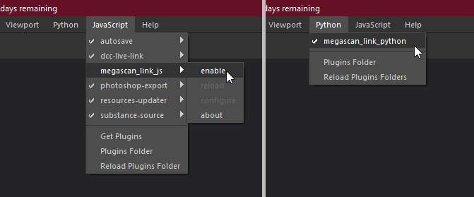
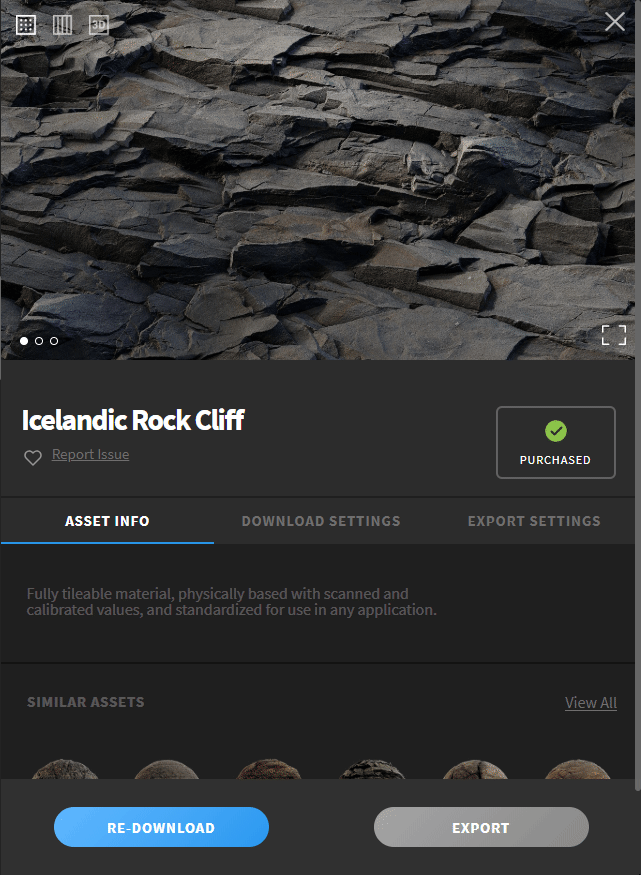
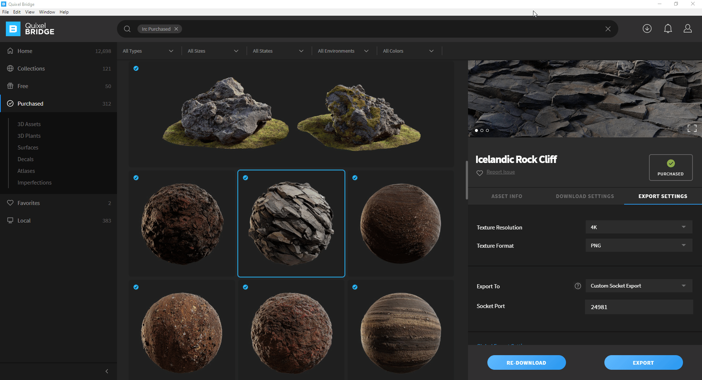
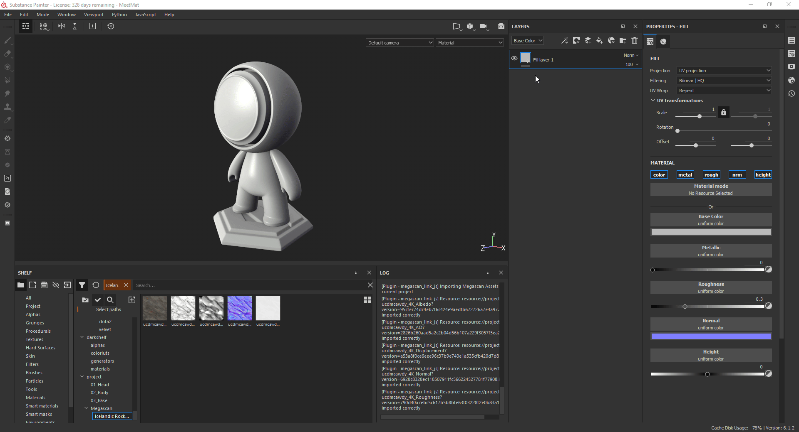

# Substance Painter Megascan Link Plugin -green)  
This plugin enable the import of Megascan Assets using the export feature of [Quixel Bridge](https://quixel.com/bridge)

## Quick start guide

For a complete guide on all the options of the plugin refere to the [How to use documentation](https://painter-megascan-link.readthedocs.io/en/latest/?badge=latest).

 - Download the plugin from the [Release Page](https://github.com/Raider-Arts/painter-megascan-link/releases) or you can [build it yourself](todoaddlink.todo)

 - Install it in Substance Painter by exctracting the zip file in the documents folder:

	- **For Windows 10** ``%userprofile%\Documents\Allegorithmic\Substance Painter``
	- **For Linux** ``~/Documents/Allegorithmic/Substance Painter``
	- **For MacOS** ``/Users/%username%/Documents/Allegorithmic/Substance Painter``

> :information_source: After you have extracted the archive open up Substance Painter and enable both plugins python 
> 

 - Select a Megascan Asset you want to export then setup Quixel Bridge to the correct export option and then click Export (Default plugin port is **24981**)

    

 - Import the currently exporting Megascan Asset to the current opened Substance Painter project:

    

 - Be sure to change the normal map **Color Space** to **Open Gl**

 	

## Import assets into project example
In this short video you can see how to import Megascan Assets from Quixel Bridge to a Substance Painter project using the Plugin

## Create project importing assets
In this other video you can see how to you can automatically create a project importing some Megascan Assets from Quixel Bridge to Substance Painter

## Want to contribute?
If you are willing to contribute you should start by [reading the dev docs](https://megascan-link.readthedocs.io/en/latest/).

**Done it?** all right it's time to clone this repository and start coding !!

After you made your changes don't forget to test them!! 

And please i'm trying to keep this plugin without any external dependencies for the ease of usage for everyone! so try to rely on what the already build-in python installation of Substance Designer has to offer

I hope this plugin helped you. 
