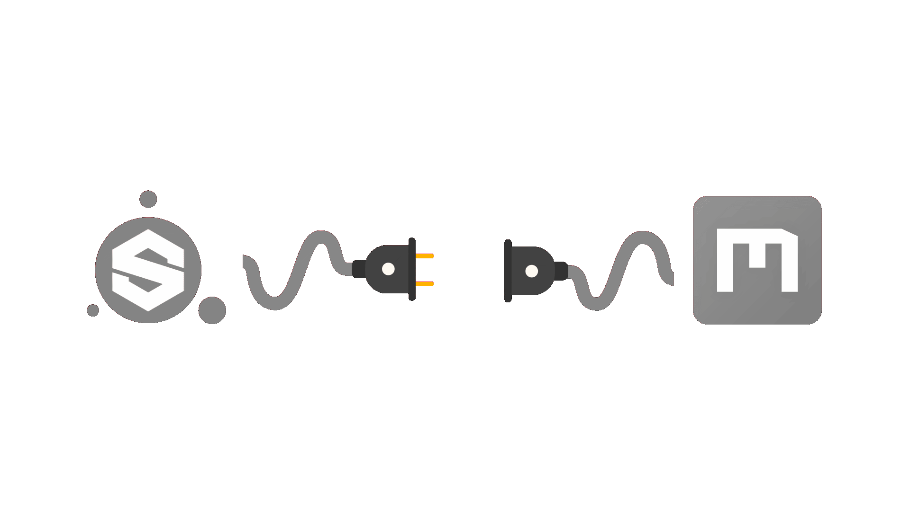

# Substance Painter Megascan Link Plugin -green)   

  

This plugin enable the import of Megascan Assets using the Custom Socket Export feature of [Quixel Bridge](https://quixel.com/bridge)

# New version notes
> **The manual installation starting from version v0.3.0-beta and later are NO LONGER REQUIRED** so you should be able to use the plugin just by installing it with no additional actions.

## Quick start guide

For a complete guide on all the options of the plugin refere to the [How to use documentation](https://painter-megascan-link.readthedocs.io/en/latest/user_guide_usage.html).

 - Download the plugin from the [Release Page](https://github.com/Raider-Arts/painter-megascan-link/releases)

 - Install it in Substance Painter by extracting the zip file in the documents folder:

	- **For Windows 10** ``%userprofile%\Documents\Adobe\Adobe Substance 3D Painter``
	- **For Linux** ``~/Documents/Adobe/Adobe Substance 3D Painter``
	- **For MacOS** ``/Users/%username%/Documents/Adobe/Adobe Substance 3D Painter``

> :information_source: After you have extracted the archive open up Substance Painter and enable both plugins python 
> 

 - Select a Megascan Asset you want to export then setup Quixel Bridge to the correct export option and then click Export (Default plugin port is **24981**)

    

 - Import the currently exporting Megascan Asset to the current opened Substance Painter project:

    

 - Be sure to change the normal map **Color Space** to **Open Gl**

 	

## Need Help?
You can always open an [issue](https://github.com/Raider-Arts/painter-megascan-link/issues) here on github or [write me a mail](mailto:luc-af@live.it) or write in this forums threads:

- [Polycount Forum](https://polycount.com/discussion/220704/substance-painter-megascan-link-plugin)
- [Quixel Forum](https://help.quixel.com/hc/en-us/community/posts/360012105958-Megascan-Link-plugin-for-Substance-Painter)

# Examples

## Import assets into project example
In this short video you can see how to import Megascan Assets from Quixel Bridge to a Substance Painter project using the Plugin

## Create project importing assets
In this other video you can see how to you can automatically create a project importing some Megascan Assets from Quixel Bridge to Substance Painter

## Auto bake on project creation
Here you can see that enabling the bake option in the plguin allow to perform and automatic baking when creating a project using a 3D Mesh (The high polygons meshes are automatically searched and if found they are used as HP meshes reference during the bake)

## Want to contribute?
If you are willing to contribute you should start by [reading the dev docs](https://painter-megascan-link.readthedocs.io/en/latest/).

**Done it?** all right it's time to clone this repository and start coding !!

After you made your changes don't forget to test them!! 
I hope this plugin helped you. 
